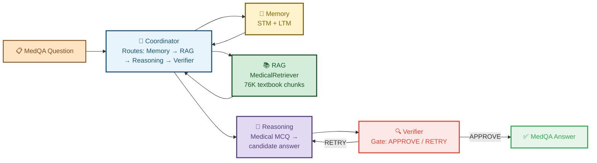
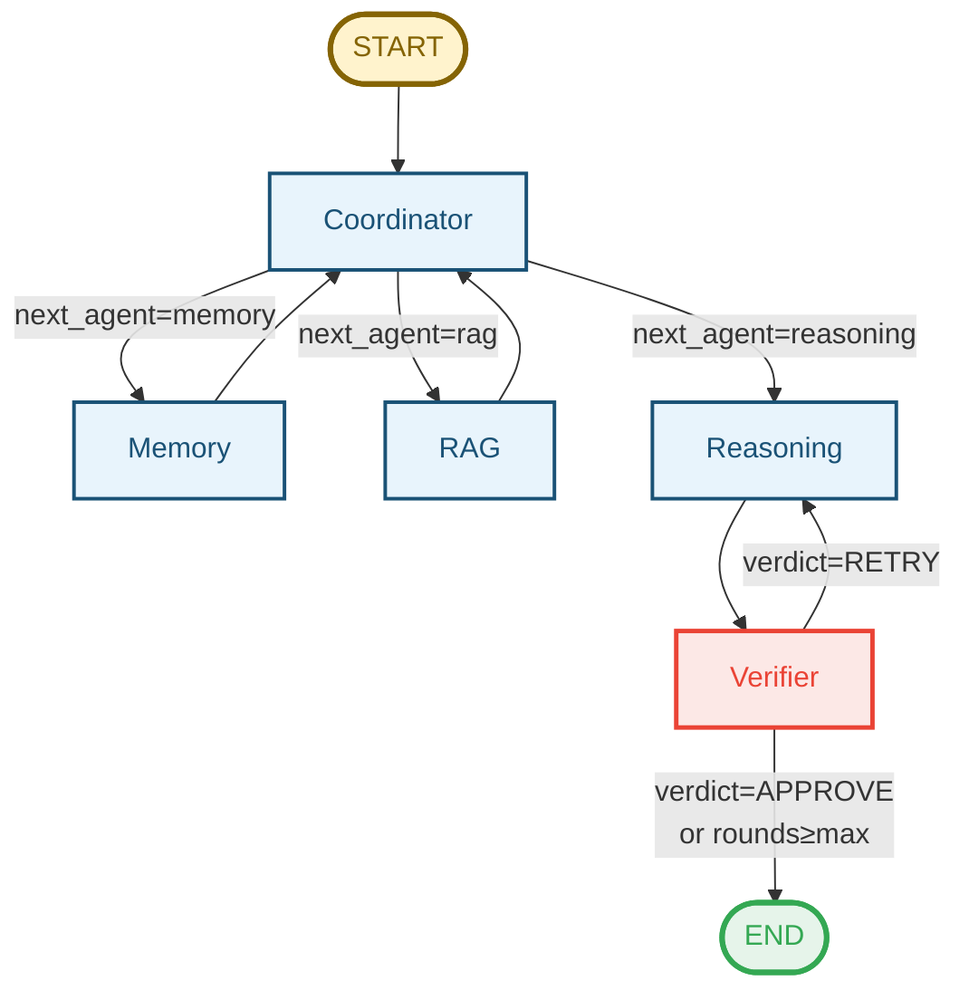

# MedQA-USMLE Multi-Agent System

> LangGraph-based multi-agent pipeline for USMLE medical question answering.
> Part of the [ai-in-sec](https://github.com/tungmq/ai-in-sec) research project.

## 🏗️ Architecture

### System Overview



### LangGraph Flow



- **1 pass** (V3): Memory → RAG → Reasoning → Verifier → END
- **Verifier loop**: If RETRY, Reasoning tries again with feedback (up to `max_rounds`)
- **State machine** via LangGraph `StateGraph` with conditional edges

### Agents

| Agent | File | Role |
|-------|------|------|
| **Coordinator** | `agents/coordinator.py` | Routes pipeline based on variant + round count |
| **Memory** | `agents/memory.py` | Short-term (STM) + long-term (LTM) memory. LTM accumulates correct answers across the run |
| **RAG** | `agents/rag.py` | Medical knowledge retrieval from 76K textbook chunks |
| **Reasoning** | `agents/reasoning.py` | Medical MCQ reasoning → candidate answer + explanation |
| **Verifier** | `agents/verifier.py` | Gate: APPROVE (pass) / RETRY (redo) with confidence score |

### Shared State

All agents share a `TypedDict` state (`agents/state.py`) with trust-tiered fields:

```
TRUSTED (set at init, never modified by LLM):
  question_id, question_stem, options, ground_truth, meta_info

UNTRUSTED (written by LLM nodes):
  messages, candidate_answer, verifier_verdict, rag_context,
  ltm_context, final_answer, node_traces, ...
```

### LLM Provider Abstraction

`llm.py` supports multiple backends via config:

| Provider | Backend | Use Case |
|----------|---------|----------|
| `ollama` | Ollama API (`/api/chat`) | Local models (Qwen3.5:9B, DeepSeek-R1:8B) |
| `opencode` | OpenAI-compatible API | Cloud (deepseek-v4-flash) |
| `openai` | OpenAI API | GPT-4o etc. |
| `openrouter` | OpenRouter API | Multi-model routing |

### RAG Pipeline

`rag/retriever.py` — **MedicalRetriever** (singleton):
- **76,848 chunks** from 14 USMLE textbooks (~110MB)
- **384-dim embeddings** (all-MiniLM-L6-v2, SentenceTransformer)
- **NumpyVectorStore** — flat cosine similarity search, no Qdrant needed
- Sources: Gynecology, Nephrology, Neurology, Surgery, Pediatrics, Psychiatry, etc.

## 📊 Variants (Ablation)

| Variant | File | Pipeline | Purpose |
|---------|------|----------|---------|
| **V0** | `variants/v0_direct.py` | LLM → Answer | Direct baseline (no agents) |
| **V1** | `variants/v1_rag_only.py` | RAG → Reasoning → Answer | RAG contribution |
| **V2** | `variants/v3_full_system.py` | RAG → Reasoning → Verifier | No memory ablation |
| **V3** | `variants/v3_full_system.py` | Memory → RAG → Reasoning → Verifier | **Full system** |
| **V4** | `variants/v3_full_system.py` | Memory → RAG → Reasoning → Answer | No verifier ablation |

All variants share the same LangGraph graph; Coordinator routes based on `_variant` config.

## 🏆 Results

All results on **MedQA-USMLE Test** — 1,273 questions (USMLE Step 1/2/3), **deepseek-v4-flash** (via opencode provider).

### Leaderboard

| Rank | Variant | Pipeline | Accuracy | Δ vs V0 | Notes |
|------|---------|----------|:--------:|:-------:|-------|
| 🥇 | **V1** | RAG → LLM → Answer | **93.09%** (1,185/1,273) | — | Best overall, simple pipeline, no technical errors |
| 🥈 | **V3** (after rerun) | Memory → RAG → Reasoning → Verifier | **88.92%** (1,132/1,273) | — | 10.7% lost to API/recursion errors |
| 🥉 | **V4** | Memory → RAG → Reasoning → Answer | **86.25%** (1,098/1,273) | — | No verifier ablation |
| | **V0** | Direct LLM → Answer | _Pending_ | — | Baseline needed for RAG contribution |

### V3 Full Multi-Agent — Detailed

| Run | Correct | Accuracy | Notes |
|-----|---------|----------|-------|
| Original | 1,087 / 1,273 | **85.39%** | 135 technical errors |
| After rerun | 1,132 / 1,273 | **88.92%** | +45 recovered, 87 still errored |
| Accuracy (known questions only) | 1,087 / 1,138 | **95.52%** | Excluding API/recursion errors |

### Error Breakdown (186 wrong out of 1,273)

| Category | Count | % |
|----------|-------|---|
| 🔴 Technical errors (recursion 93 + API 500/503 42 + timeout 1) | 136 | 10.7% |
| ❌ Over-generalization | 10 | 0.8% |
| ❌ Missed critical detail | 5 | 0.4% |
| ❌ Medical knowledge gap | 32 | 2.5% |
| ❌ Verifier failed | 3 | 0.2% |
| ❌ Extraction error | 1 | 0.1% |
| **Total wrong** | **186** | **14.6%** |

### ⚠️ Key Finding: Verifier is Non-Functional

- **1,138 APPROVE / 0 RETRY** across all non-errored questions
- Verifier uses the **same model** as Reasoning → cannot self-verify
- Confidence remains 0.80–0.95 even on demonstrably wrong answers

## 📁 Directory Structure

```
medqa_usmle/
├── __init__.py
├── llm.py                      # LLM provider abstraction (Ollama / OpenAI)
├── agents/
│   ├── __init__.py
│   ├── coordinator.py          # Pipeline router
│   ├── graph.py                # LangGraph StateGraph builder
│   ├── memory.py               # STM + LTM manager
│   ├── prompts.py              # System prompts for each agent
│   ├── rag.py                  # Medical RAG node
│   ├── reasoning.py            # Medical reasoning node
│   ├── state.py                # Shared AgentState TypedDict
│   └── verifier.py             # Gate node (APPROVE / RETRY)
├── configs/
│   ├── __init__.py             # YAML config loader with ${ENV_VAR} support
│   └── reproducibility.yaml    # Config: model, pipeline, paths
├── data/
│   └── loader.py               # MedQA dataset loader
├── eval/
│   ├── __init__.py
│   ├── grader.py               # Accuracy, error analysis
│   ├── stats.py                # McNemar test, Bootstrap CI
│   └── tables.py               # Leaderboard, error tables
├── rag/
│   ├── __init__.py
│   └── retriever.py            # MedicalRetriever (singleton)
├── variants/
│   ├── __init__.py
│   ├── v0_direct.py            # Direct LLM baseline
│   ├── v1_rag_only.py          # RAG + Reasoning
│   ├── v3_full_system.py       # V2/V3/V4 (config-driven)
│   ├── v3_rerun_errors.py      # Rerun failed questions
│   └── v3_rerun_v2.py          # Rerun v2 with extended timeout
├── outputs/                    # (gitignored) Predictions + traces + results
│   ├── predictions_v3_test_*.jsonl
│   ├── traces_v3_test_*.jsonl
│   └── RESULTS_SUMMARY.md
└── check_preds.py / check_preds2.py / check_rerun.py  # Analysis scripts
```

## 🚀 Quick Start

### Prerequisites

```bash
pip install langgraph langchain-core numpy sentence-transformers pyyaml requests
```

### Run V3 Full System

```bash
cd /path/to/ai-in-sec
PYTHONPATH=. python3 -u medqa_usmle/variants/v3_full_system.py --split test
```

### Run Ablation Variants

V2, V3, V4 are all in `v3_full_system.py`. The variant is selected via config:

```yaml
# configs/reproducibility.yaml
_variant: v3  # or v2, v4
```

### Evaluate Results

```bash
python3 medqa_usmle/check_preds.py    # Quick accuracy check
```

### Configuration

Edit `configs/reproducibility.yaml`:

```yaml
model:
  provider: opencode          # ollama | opencode | openai | openrouter
  name: deepseek-v4-flash     # or qwen3.5:9b, gpt-4o, etc.
  temperature: 0.0
  num_predict: 4096
  api_key: ${OPENCODE_API_KEY}
  base_url: https://opencode.ai/zen/go/v1

pipeline:
  max_rounds: 5
  verifier_threshold: 0.7
```

## 📈 Recommendations

1. **Add retry wrapper** at the provider layer for transient API errors
2. **Use a separate model** for the Verifier (or fine-tune a classifier)
3. **Cap recursion** with a maximum round limit and graceful fallback
4. **Consider local models** (Ollama) to eliminate API reliability issues
